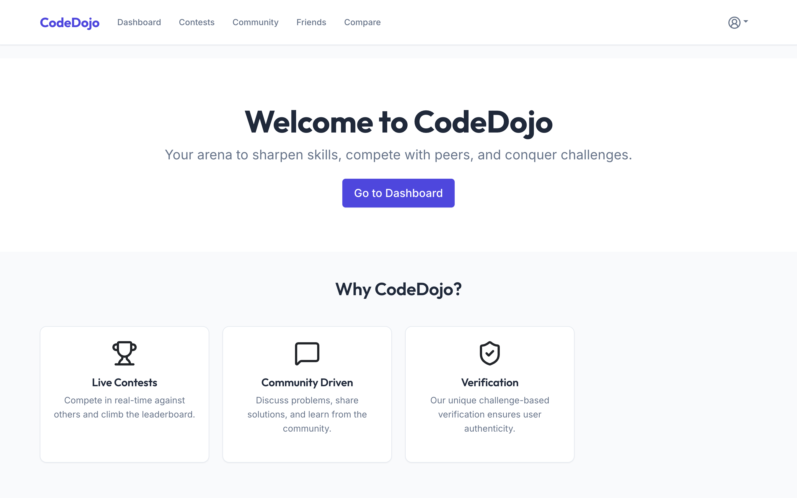
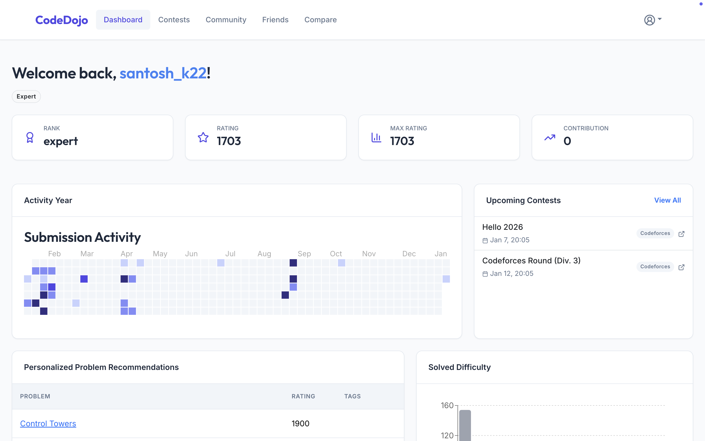
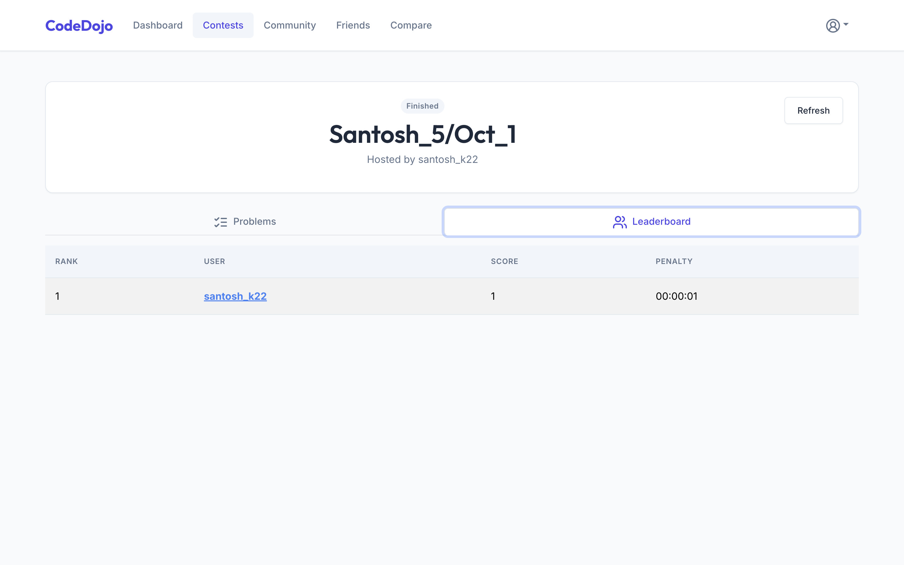
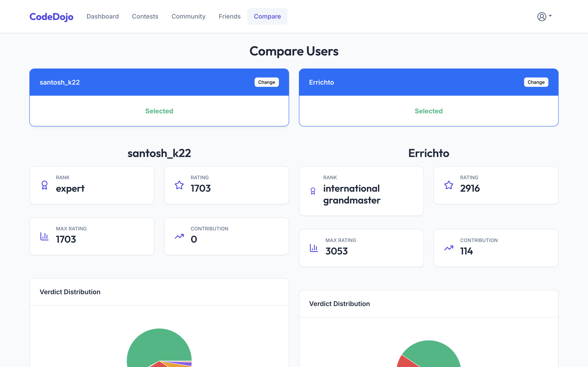

# 🥋 CodeDojo

> **Level up your competitive programming skills.**


<div align="center">
  <a href="https://codedojo-client.vercel.app">
    
  </a>
  <a href="https://codedojo-backend.onrender.com">
    
  </a>
</div>

**CodeDojo** is a comprehensive training platform designed for competitive programmers. It integrates directly with the **Codeforces API** to provide advanced analytics, contest hosting, and personalized problem recommendations that go beyond the standard platform features.

---

## 📋 Table of Contents
- [Features](#-features)
- [Screenshots](#-screenshots)
- [Deployment](#-deployment)
- [Tech Stack](#-tech-stack)
- [Project Structure](#-project-structure)
- [Getting Started](#-getting-started)
- [License](#-license)

---

## ✨ Features

### 🛡️ Secure Authentication
- **Challenge-Based Login**: Authenticate securely using your existing Codeforces account. No new passwords to remember—just a simple cryptographic challenge using your profile settings.

### 📸 Screenshots
<div align="center">
  
  <p><i>Landing Page</i></p>
  <br/>

  
  <p><i>User Dashboard</i></p>
  <br/>

  
  <p><i>Real-time Contest Leaderboard</i></p>
  <br/>

  
  <p><i>Head-to-Head Comparison</i></p>
</div>

> **Want to see more?** Check out the full gallery in the [screenshots folder](./assets/screenshots).

### 🌍 Deployment
This project is fully deployed and available for use:

- **Frontend**: Hosted on [Vercel](https://codedojo-client.vercel.app)
- **Backend**: Hosted on [Render](https://codedojo-backend.onrender.com)
- **Database**: MongoDB Atlas

To deploy your own instance, follow the [Getting Started](#-getting-started) guide below.

### 🏆 Custom Contests
- **Host Your Own**: Create private contests with custom durations and problem sets.
- **Real-Time Leaderboard**: Live ICPC-style standings with penalty tracking and auto-refresh.
- **Smart Caching**: Optimized performance even with multiple participants.

### 📊 Advanced Analytics
- **Performance Heatmap**: GitHub-style submission activity grid.
- **Verdict Distribution**: Visualize your AC, WA, TLE, and RTE rates.
- **Rating Distribution**: Analyze your solved problems by difficulty rating (800-3500).
- **Tag Mastery**: See which topics (DP, Graphs, Number Theory) you dominate and where you lack.

### 🤝 Community & Friends
- **Player Comparison**: Compare your stats side-by-side with any other coder.
- **Community Forum**: Discuss problems, share tutorials, and upvote quality content.

### 🧠 Smart Recommendations
- **AI-Driven Suggestions**: Get problems tailored specifically to your rating range to maximize improvement.
- **Unsolved Filter**: Automatically ignores problems you've already cracked.

---

## 🛠 Tech Stack

| Component | Technology | Description |
|-----------|------------|-------------|
| **Frontend** | React + Vite | Fast, responsive UI |
| **Styling** | React-Bootstrap | Modern, grid-based layout |
| **Charts** | Recharts | Interactive data visualization |
| **Backend** | Node.js + Express | RESTful API architecture |
| **Database** | MongoDB | Flexible schema for users & contests |
| **Data** | Codeforces API | Real-time competitive data |

---

## 📂 Project Structure

```bash
CodeDojo/
├── api/                    # Backend API Logic
│   ├── auth/               # Authentication & Challenge Logic
│   ├── community/          # Forum Posts & Comments
│   ├── contests/           # Contest Management & Leaderboards
│   ├── profile/            # User Stats & Analysis
│   └── users/              # User Data Management
├── client/                 # React Frontend
│   ├── src/
│   │   ├── app/            # Global Context & API Config
│   │   ├── features/       # Reusable Components (Charts, Cards)
│   │   ├── layouts/        # Page Layouts (Navbar)
│   │   ├── pages/          # Full Page Views
│   │   └── utils/          # Helpers (Colors, Formatting)
└── server.js               # Main Server Entry Point
```

---

## 🚀 Getting Started

### Prerequisites
- **Node.js** (v16 or higher)
- **MongoDB** (Local instance or Atlas URI)

### Installation

1.  **Clone the Repository**
    ```bash
    git clone https://github.com/santosh-k22/CodeDojo.git
    cd CodeDojo
    ```

2.  **Setup Backend**
    ```bash
    # Install server dependencies
    npm install

    # Create .env file
    echo "MONGO_URI=mongodb://localhost:27017/codedojo" > .env
    echo "JWT_SECRET=supersecretkey" >> .env
    echo "PORT=5001" >> .env

    # Start the server
    npm start
    ```

3.  **Setup Frontend**
    ```bash
    # In a new terminal
    cd client
    npm install

    # Start the UI
    npm run dev
    ```

4.  **Explore**
    Navigate to `http://localhost:5173`.

---


## 📝 License
**Proprietary - All Rights Reserved**

Created by **Santosh** for CodeDojo.
